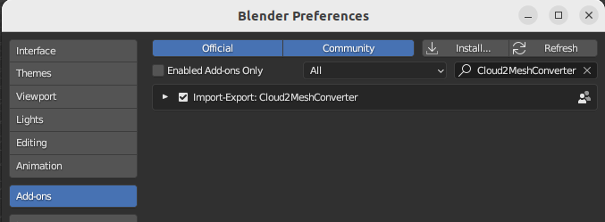
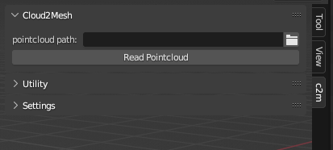
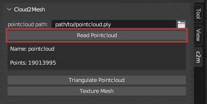

# Cloud2MeshConverter
Blender Addon for cloud to mesh conversion including texturing

## Installation
There are two ways to install the addon:
- Clone this repository into blenders addon folder. The path usually looks like this: `path/to/blender/x.xx/scripts/addons`.
- Download the project by using GitHubs `Download ZIP` function.
After that install the addon:

In both cases search for "Cloud2Mesh" and tick the box.

This process can take some time because some dependencies has to be installed.
Now the UI should appear on the right side:

> **_NOTE:_** 
> It is very useful to open the console while using the addon. 
> For that use `Window > Toggle System Console`.

## Read Pointcloud
To read a pointcloud first choose a file. Supported file formats are `ply`, `pcd`, `pts`, `xyz`, `xyzn`, `xyzrgb`
and `las`. After that click the `Read Pointcloud` button. The pointcloud's name and the point count are displayed below.

## Triangulation
Before using `Triangulate Pointcloud` have a look at the `Settings` section. 
It is recommended to reduce the number points (`downsampling size`) for big clouds. 
When the algorithm finished, a new collection including the mesh is created :

| Property            | Description                                                  |
|---------------------|--------------------------------------------------------------|
| `downsampling size` | Number of pointcloud points used for triangulation.          |
| `depth`             | Higher value means more detail, but higher calculation time. |

## Texturing
In this step a texture for the mesh is calculated using the pointcloud. It will only work if the cloud contains color data.
First choose an output path. After that think about the texture size. The runtime is mainly depending on the number of triangles and 
the texture's resolution. Try to decimate the mesh as much as possible without changing shape too much (see [Decimation](#Decimation)).
High resolution textures will take some time. It can be wise to do some tests with smaller resolution.

| Property          | Description                                                                                                                   |
|-------------------|-------------------------------------------------------------------------------------------------------------------------------|
| `output path`     | Output path for the texture. If output_path is empty the path of the pointcloud is used.                                      |
| `pointcloud size` | Number of pointcloud points used for texturing. Affects startup time.                                                         |
| `size`            | Texture size. Resulting resolution are `size x size` pixels.                                                                  |
| `subpixels`       | Number of subpixels. If the value is 4, the texture is calculated as it had 4 times as much pixels. (only use square numbers) |
| `pixel corners`   | Used to reduce seams, but increases calculation time.                                                                         |
 

## Utility
### Vertex removal
The surface reconstruction algorithm sometimes produces low density triangles. In some cases these extra triangles are useful,
because they fill holes, in other cases they form weird shapes, particularly on the meshes edges. For this case the operator
swtiches to edit mode and a percentage of the lowest density triangles are selected. The selection can be adjusted by hand.
Press `del` to remove selected faces/vertices. 

### Decimation
There is no UI for this, because Blender already has a builtin decimation Function. Go to `EDIT` mode and select an area (or press `A` for all).
After that go `Mesh > CleanUp > Decimate Geometry`. It is recommended to decimate the parts of your mesh more that has less detail like (e.g a flat floor).
